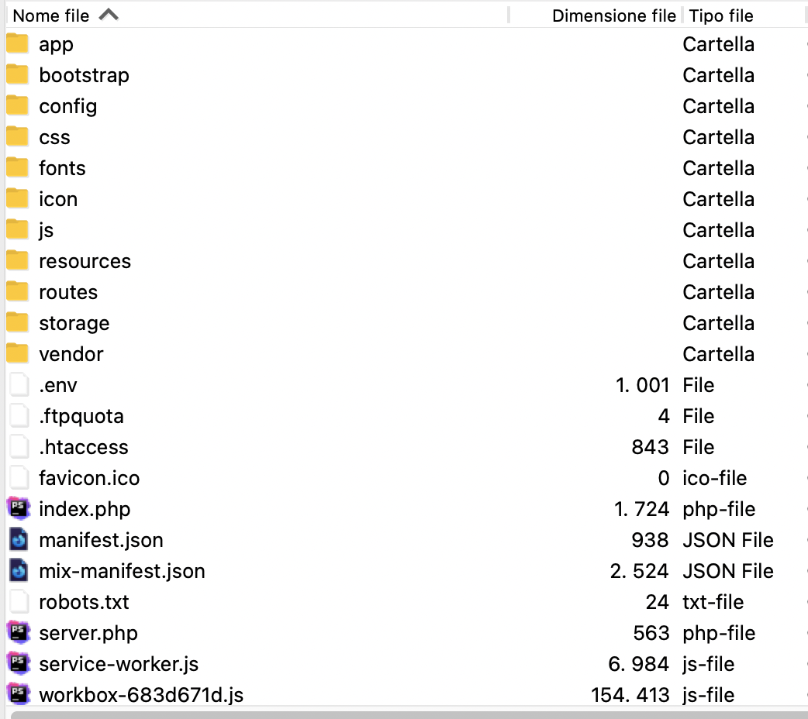

# Installation

### TL/DR;
```
./scripts/init.sh
```

### Basic Assets
Create icons for the site(using: https://www.favicon-generator.org/):

Create folder icon and image inside public:
```
cd [PROJECT_FOLDER]
cd public
mkdir icon images
```

Insert generated icons in icon's folder and logo.png in images.

### Cleaning
Clean the repo history from scaffold's one:
```
cd [PROJECT_FOLDER]
rm -rf .git
rm package-lock.json
```
Start git flow support:
```
git init
git flow init
git add --all
git commit -m"init"
git remote add origin https://github.com/user/repo
git push -u origin develop
```
### Tls support
Get tls support(run in project folder):
```
valet secure [PROJECT_FOLDER_NAME]
```

### Backend
Install dependency:
```
composer install
```
Init app's configuration:
```
cp .env.example .env
sed -i '' -e 's/APP_NAME=App/APP_NAME=[NEW_APP_NAME]/g' .env
# Set production url
sed -i '' -e 's|MIX_APP_URL=https://app.test|MIX_APP_URL=https://[SITE_URL]|g' .env
sed -i '' -e 's|MIX_DEV_APP_URL=https://app|MIX_DEV_APP_URL=https://[PROJECT_FOLDER]|g' .env
sed -i '' -e 's/DB_DATABASE=app/DB_DATABASE=[NEW_DATABASE_NAME]/g' .env
```
Create app's database:
```
mysql -uroot -e "CREATE DATABASE [NEW_DATABASE_NAME];"
```
Generate app's key:
```
artisan key:generate
```
Link app's storage:
```
artisan storage:link
```
Run default migration for users and roles:
```
artisan migrate:fresh --seed
```

### Frontend
Remove package-lock json relative to scaffold and set app's name:
```
sed -i '' -e 's/"name": "app",/"name": "[NEW_APP_NAME]",/g' package.json
```
Install dependency:
```
npm install
```
Build dev assets:
```
npm run dev || npm run watch
```

# Production
### TL/DR;
```
./scripts/production.sh DB_HOST DATABASE DBUSER DBPASS
```
Turn off debug mode and change environment:
```
sed -i '' -e 's|APP_DEBUG=true|APP_DEBUG=false|g' .env
sed -i '' -e 's|MIX_APP_ENV=local|MIX_APP_ENV=production|g' .env
```
Update database config:
```
# Run only if [DB_URL] differs from localhost
sed -i '' -e 's|DB_HOST=127.0.0.1|DB_HOST=[DB_HOST]|g' .env
sed -i '' -e 's|DB_DATABASE=[DB_LOCAL_DATABASE]|DB_DATABASE=[DB_DATABASE]|g' .env
sed -i '' -e 's|DB_USERNAME=root|DB_USERNAME=[DB_USERNAME]|g' .env
sed -i '' -e 's|DB_PASSWORD=|DB_PASSWORD=[DB_PASSWORD]|g' .env
```
Build assets:
```
composer install --optimize-autoloader --no-dev
npm run production
```
After asset building paste the content of **manifest.json** at the top of **mix-manifest.json** with the necessary edit, for PWA support.

## VPS

## Shared Hosting

### Prepare assets
Clean bootstrap cache in `bootstrap` folder

Run:
```
artisan route:cache
artisan view:cache
# you need to replace all the local paths 
# to the server paths if you cache the config
artisan config:cache
```

### DB Copy
Make a dump of the local database:
```
mysqldump -u root --databases [DATABASE_NAME] > db.sql 
```

Rename all the occurrencies of the local database with the new one if differs.

Then restore the dump on the server database, or if you can connect externally to the server database run `artisan migrate fresh --seed` with the db credentials inserted in the `.env` file.

### Folders Copy
The files and folders' structure you need to upload to the hoster:



Upload the folders like in the image above.

Then copy the content of the public's folder in the root of the site **except for the `index.php` and `.htaccess` files** that you'll find in the `.shared_hosting` folder of this repo.

Upload `filesystems.php` from `.shared_hosting` to the `config` folder on the hosting.

Upload `AppServiceProvider.php` from `.shared_hosting` to the `app/Providers` folder on the hosting.


# Table.ts

### Cell types:

- "avatar"
- "avatar-stack"
- "progress-bar"
- "date"
- "actions"
- "array"
- "long-text"

## About Scaffold

This scaffold is intended to improve the speed of the creation of a control panel.

The Vue principal components are in the common folder:
- common
    - Forms
        - FormActions.vue
        - FormGenerator.vue
    - Pages
        - ListPage.vue
        - PageHeader.vue
    - Search
        - Search.vue
        - SearchHeader.vue
    - Table
        - Index.vue
    - Uploader
        - ImageUploader.vue
    - NoEntities.vue


# list-page

## Slots

| Name     | Description |
| -------- | ----------- |
| `header` | &nbsp;      |

## Props

| Name                           | Type       | Description |
| ------------------------------ | ---------- | ----------- |
| `entities` *required*          | `any[]`    |             |
| `search-options` *required*    | `string[]` |             |
| `columns` *required*           | `TCell[]`  |             |
| `entity-name` *required*       | `string`   |             |
| `entity-new-button` *required* | `string`   |             |
| `retrieve-entity` *required*   | `Function` |             |
| `edit-entity` *required*       | `Function` |             |
| `excel-header`                 | `string[]` |             |
| `excel-data`                   | `Function` | &nbsp;      |

## Computed Properties

| Name                | Type      | Description                                  |
| ------------------- | --------- | -------------------------------------------- |
| `capitalizedEntity` | `unknown` | **Dependencies:** `entityName`               |
| `filtersKey`        | `string`  | **Dependencies:** `capitalizedEntity`        |
| `excelSupport`      | `boolean` | **Dependencies:** `excelHeader`, `excelData` |

## Methods

### getEntity()

**Syntax**

```typescript
getEntity(): void
```

